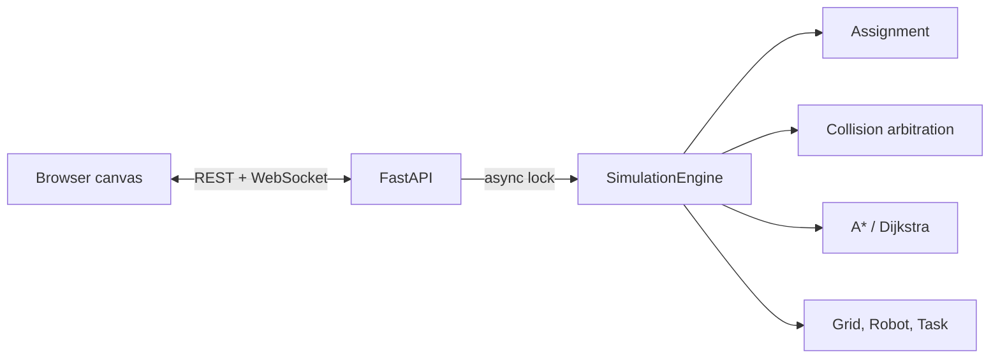
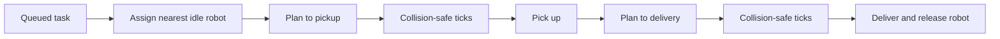

# RoboFleet Lite

## Multi-Robot Warehouse Path-Planning Simulator

RoboFleet Lite is a browser-based, backend-authoritative 2D warehouse simulator. It coordinates exactly three simulated robots, assigns delivery jobs by reachable route distance, streams state over WebSockets, and visualizes real paths and metrics. It is an interview-focused software simulator—not a production autonomous-robot deployment.

## Features

- From-scratch A* and Dijkstra on a four-direction rectangular grid
- Three robots (`R1`–`R3`) with explicit task and robot state machines
- Nearest-available assignment using A* route length and robot-ID tie-breaking
- Deterministic movement arbitration preventing same-cell and edge-swap collisions
- Dynamic obstacle insertion (click the grid), removal API, and affected-route replanning
- FastAPI REST controls, live WebSocket snapshots, responsive vanilla-JS canvas dashboard
- Real tick, task, distance, conflict, replan, path-length, expansion, and planning-time data
- Deterministic evaluation and automated algorithm, coordination, API, and WebSocket tests

State is held in memory; restarting the backend resets the simulation.

## Architecture



Core domain and algorithms do not import FastAPI. `SimulationEngine.tick()` is deterministic and has no sleep; only the application loop supplies real time.

## Simulation model

Coordinates use `(x, y)`, with columns increasing right, rows increasing down, and `(0, 0)` at top-left. Every move crosses one cardinal grid edge at cost 1. A task follows `QUEUED → ASSIGNED → PICKED_UP → DELIVERED`; a robot follows `IDLE → MOVING_TO_PICKUP → MOVING_TO_DELIVERY → IDLE`, with explicit `WAITING` and `REPLANNING` states.



## Algorithms and coordination

A* uses `f(n) = g(n) + h(n)`, unit edge costs, and Manhattan distance. Dijkstra uses the same grid and reconstruction logic with no heuristic. Both return paths including start and goal, or an empty path when unreachable. Comparison results are measured during each request; timing is machine-dependent.

At each tick, robots propose one next cell. Robot-ID priority deterministically resolves vertex conflicts, occupied stationary cells, and opposite-direction edge swaps. A rejected move becomes a wait and increments conflict metrics. Safety is prioritized over completeness: prioritized coordination can wait indefinitely or deadlock in adversarial narrow corridors and is not a complete MAPF solver.

Adding a dynamic obstacle rejects static cells, endpoints, and occupied cells. If it intersects a remaining path, the robot replans from its current cell without teleporting. An unreachable target leaves the robot safely waiting with a reason; removing relevant obstacles retries planning.

## Project structure

```text
app/models/                 Domain types and grid
app/services/pathfinding/   A* and Dijkstra
app/services/coordination/  Movement conflict resolution
app/services/simulation/    Scenario and authoritative engine
app/api/                    WebSocket connection manager
app/web/                    HTML/CSS/vanilla-JS dashboard
tests/                      Deterministic automated tests
scripts/evaluate.py         Reproducible evaluation
docs/                       Architecture, algorithms, results, interview guide
```

## REST and WebSocket API

| Method | Endpoint | Purpose |
|---|---|---|
| GET | `/health` | Liveness |
| GET | `/api/state`, `/grid`, `/robots`, `/tasks`, `/metrics` | Current state/resources |
| POST | `/api/tasks` | Create pickup/delivery job |
| POST / DELETE | `/api/obstacles`, `/api/obstacles/{x}/{y}` | Add/remove dynamic obstacle |
| POST | `/api/simulation/start`, `/pause`, `/reset`, `/tick` | Simulation controls |
| POST | `/api/pathfinding/compare` | Run A* and Dijkstra on identical inputs |
| WS | `/ws/simulation` | Initial and live authoritative snapshots |

Snapshots include the grid, obstacle sets, robots and remaining paths, tasks, metrics, tick, and running state. Broken clients are removed independently.

## Dashboard and metrics

The dashboard draws warehouse cells, fixed/dynamic obstacles, endpoints, three distinct robots, and their remaining paths. It provides start, pause, step, reset, task dispatch, click-to-add-obstacle, connection status, fleet state, and metrics. JavaScript only renders server state; it does not calculate robot movement.

## Setup and running locally

Requires Python 3.12-compatible Python.

```powershell
python -m venv .venv
.\.venv\Scripts\python.exe -m pip install -r requirements.txt
.\.venv\Scripts\python.exe -m uvicorn app.main:app --reload
```

Open `http://127.0.0.1:8000`.

## Testing, evaluation, and CI

```powershell
.\.venv\Scripts\python.exe -m pytest -v
.\.venv\Scripts\python.exe -m scripts.evaluate
.\.venv\Scripts\python.exe -m compileall app tests scripts
```

The seeded 250-tick safety test asserts unique positions and rejects edge swaps at every tick. Evaluation output is written to `docs/evaluation-results.json`; see [evaluation methodology](docs/evaluation.md). GitHub Actions runs the full suite on Python 3.12 via `.github/workflows/tests.yml`.

## Limitations and future improvements

- Discrete cells, perfect localization, instantaneous decisions, and no acceleration or battery model
- In-memory, single-process authority; multi-process deployment needs shared state or a single simulation owner
- Prioritized one-tick arbitration is safe but incomplete and can deadlock/starve
- No persistent jobs, authentication, ROS, physical controls, or uncertainty model
- Timing measurements vary by machine

Natural extensions include time-expanded reservations, deadlock detection, fairness aging, CBS for stronger MAPF completeness, D* Lite for incremental replanning, persistent event logs, and a dedicated simulation actor for horizontal API scaling.
